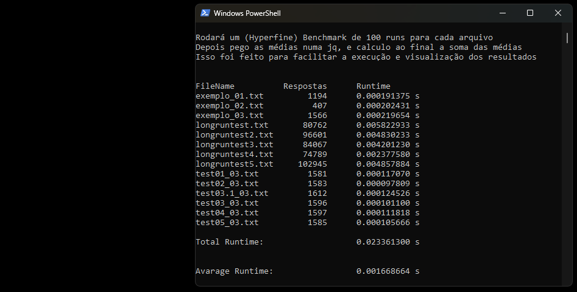

# Requisitos
- ***Docker***

# Como Rodar
### PowerShell(MS)  *ou*  Shell(Linux)
> Execute uma linha de cada vez no console, sempre esperando a anterior terminar de executar
`e não esqueça de escrever o "."`

1. Ir ao **diretório** do *Dockerfile*
- **PowerShell**/***Bash***
```PowerShell
cd Path/to/submissions/gabrielng-rj99/Problema_1/Rust/
```


2. *Gerar* a **Imagem** do *Dockerfile*
- **PowerShell**/***Bash***
```PowerShell
docker build -t problem_1:gabrielng-rj99 . 
```

3. *Gerar* um **conteiner** da *imagem* e rodá-lo
- **PowerShell**/***Bash***
```PowerShell
docker run --cpus=2 --memory=2g --name gng-rj99_p1 problem_1:gabrielng-rj99
```

- **Resultado Esperado(Print):**




4. Caso queira rodar o conteiner novamente (sem gerar num novo conteiner)
- **PowerShell**/***Bash***
```PowerShell
docker start -a gng-rj99_p1
```


### Para apagar os conteiners da imagem e a imagem:

#### 1. Parar todas os conteiners da imagem "*problem_1:gabrielng-rj99*"

---

- **PowerShell** `docker ps -aq --filter ancestor=problem_1:gabrielng-rj99 | ForEach-Object { docker stop $_ }`

- ***Bash*** `docker ps -a | grep problem_1:gabrielng-rj99 | awk '{print $1}' | xargs docker stop`

---

#### 2. Remover todas os conteiners da imagem "*problem_1:gabrielng-rj99*"

---

- **PowerShell** `docker ps -aq --filter ancestor=problem_1:gabrielng-rj99 | ForEach-Object { docker rm $_ }`

- ***Bash*** `docker ps -a | grep problem_1:gabrielng-rj99 | awk '{print $1}' | xargs docker rm`

--- 

#### 3. Remover a imagem criada
- **PowerShell**/***Bash***
```bash
docker rmi problem_1:gabrielng-rj99
```

# Notas:

1. Sinta-se a vontade para alterar os parâmetros do benchmark como 
WARMUP e RUNS no run_commands.sh

### Rodar mais exemplos/arquivos
- basta colocar todos os arquivos na pasta "examples" abaixo **ANTES** de criar a **imagem** como na foto do **"*Resultado Esperado*"**
> Path / to /submissions/gabrielng-rj99/Problema_1/Rust/examples